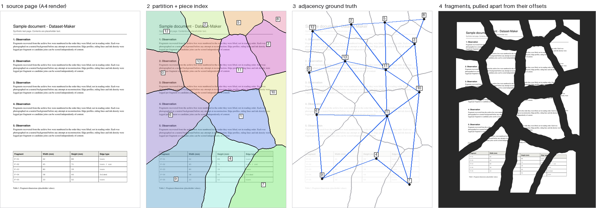
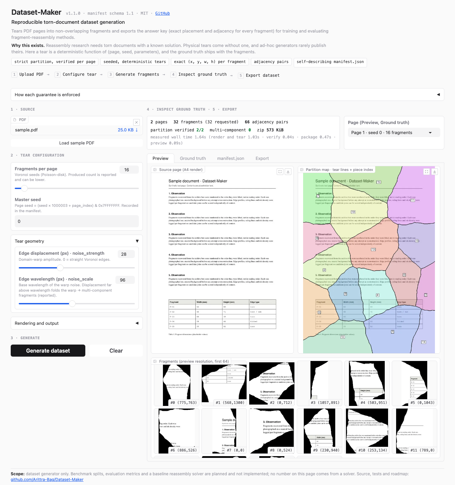

# Dataset-Maker

**Reproducible torn-document dataset generation.**

Dataset-Maker tears PDF pages into non-overlapping fragments and exports the
answer key with them: the exact placement of every fragment and which fragments
share a torn edge. The output is meant for training and evaluating
fragment-reassembly methods (document forensics, archival fragment matching,
image stitching).



*One page of the bundled sample, A4 at 100 DPI, 14 fragments, seed 7.
Regenerate with `python scripts/make_assets.py`.*

## Why this exists

Reassembly research needs torn documents with a known solution. Physical tears
come without one, and ad-hoc generators rarely publish theirs, which makes
results hard to compare. Here a tear is a deterministic function of
(page, seed, parameters), and the ground truth ships with the fragments.

## What it guarantees, and how each claim is checked

| Guarantee | Meaning | Enforced by |
|-----------|---------|-------------|
| Strict partition | Every pixel belongs to exactly one fragment: no overlap, no gaps. | `verify_partition()` runs on **every page** of every run; generation aborts on failure. `tests/test_partition.py` |
| Deterministic tears | Same seed, parameters and DPI give the same partition, offsets and adjacency. | `tests/test_pipeline.py` (two runs compared), golden hash in `tests/test_partition.py` |
| Exact placement | Each fragment's `(x, y, w, h)` on the page canvas. A lossless export reassembles the rendered page pixel-exactly. | `tests/test_pipeline.py` executes the published reassembly snippet on an extracted ZIP and compares every pixel |
| Adjacency | Undirected `[i, j]` pairs of fragments sharing a torn border (4-connectivity). | Known-grid and graph-connectivity tests |
| Self-describing export | `manifest.json` records master seed, page seeds, parameters, input SHA-256 and library versions. | `tests/test_pipeline.py` |

### How the partition works

Each pixel is assigned to its nearest seed point (`argmin`), a Voronoi
tessellation, which is already a partition. To make edges look torn, the pixel
grid is **domain-warped** with value noise *before* the nearest-seed query.
Warping the query coordinates, not the assignment rule, keeps the result a
partition while boundaries become jagged. Seeds come from Bridson Poisson-disk
sampling so fragment areas stay in a sane range.

Related fragment literature:
[Eroded Boundaries](https://arxiv.org/pdf/1912.00755),
[Pairwise Irregular Fragments](https://arxiv.org/pdf/2507.09767),
[Deepzzle](https://arxiv.org/abs/2005.12548).

## The app



Workflow: **upload PDF → configure tear → generate → inspect ground truth → export**.

* **Preview**: source page, partition map with piece indices, fragment thumbnails.
* **Ground truth**: adjacency graph, per-page checks (overlap, coverage,
  produced vs requested fragments, multi-component fragments, graph
  connectivity), and a per-fragment table (`x, y, w, h, area, degree`).
* **manifest.json**: the actual manifest of the run, with a field reference.
* **Export**: the ZIP, its real contents, and a runnable reassembly snippet.

Every number in the UI is measured from the current run (stage timings use
`time.perf_counter`). There is no solver in this repository yet, so no
reconstruction accuracy is shown anywhere.

## Run locally

Use **Python 3.10 to 3.12**. Python 3.13/3.14 have no PyMuPDF 1.24 wheel and
fall back to a source build.

```bash
python3.11 -m venv .venv && source .venv/bin/activate
pip install -r requirements.txt
python app.py            # http://127.0.0.1:7860 (local only, no public share link)
pytest -q                # partition, determinism, manifest, round-trip, UI smoke tests
```

Click **Load sample PDF** to try it without your own file. Generation is also
callable without the UI:

```python
from src.pipeline import generate_dataset

run = generate_dataset("doc.pdf", source_name="doc.pdf", dpi=150, n_pieces=16,
                       noise_strength=28.0, noise_scale=96.0, master_seed=0,
                       lossy=False)
open("dataset.zip", "wb").write(run.zip_bytes)
print(run.timings, [r.is_partition for r in run.reports])
```

## Output

```
dataset.zip
├── manifest.json                 ground truth + provenance
├── README.txt                    schema summary + reassembly snippet
└── pieces/page_0001/piece_000.png   RGB, tight bbox crop, black outside the fragment
```

`manifest.json` (schema 1.1, abridged from a real run):

```json
{
  "generator": "Dataset-Maker",
  "generator_version": "1.1.0",
  "schema_version": "1.1",
  "source": "sample.pdf",
  "source_sha256": "…",
  "dpi": 150,
  "n_pieces_requested": 16,
  "master_seed": 0,
  "page_seed_rule": "(master_seed * 1000003 + page_index) & 0x7FFFFFFF",
  "noise_strength": 28.0,
  "noise_scale": 96.0,
  "lossy": false,
  "environment": {"python": "3.11.14", "numpy": "1.26.4", "scipy": "1.13.1", "pillow": "10.4.0", "pymupdf": "1.24.10"},
  "pages": [
    {
      "index": 0, "seed": 0, "width": 1240, "height": 1754,
      "adjacency": [[0, 1], [0, 3], [0, 4], "…"],
      "pieces": [{"file": "pieces/page_0001/piece_000.png", "x": 775, "y": 763, "w": 334, "h": 548}, "…"]
    }
  ],
  "total_pieces": 32
}
```

* `x, y` is the top-left offset of the fragment's bounding box on the page
  canvas: the stitching label. `w, h` equals the PNG size.
* `adjacency` lists sorted, deduplicated pairs `i < j`; any unlisted pair is a
  negative for pairwise models.
* Schema 1.1 only **adds** provenance fields (`generator_version`,
  `schema_version`, `source_sha256`, `n_pieces_requested`, `master_seed`,
  `page_seed_rule`, `environment`, `pages[].seed`). Every 1.0 field keeps its
  name, type and meaning.

## Reproducibility, precisely

* The **partition** (labels, offsets, adjacency) depends only on DPI (which
  fixes the A4 canvas size), requested fragment count, page seed and the two
  noise parameters. PDF content never influences where the tears go.
* **Fragment pixels** additionally depend on the PDF renderer, so they are
  reproducible within the environment recorded in `manifest.environment`.
* **ZIP bytes** are not reproducible: `created_utc` and zip entry timestamps
  change on each run. Contents are.
* Bit-for-bit reproducibility across platforms is pinned by a golden hash test.
  It is verified on macOS arm64 locally; CI on Linux is its cross-platform
  check.

## Known limitations

* **Masks are implicit.** A fragment's shape is its non-black pixels. Pure-black
  ink touching a tear is indistinguishable from background. Reassembly is still
  exact, but contour ground truth is slightly ambiguous there. No alpha/mask
  export yet.
* **Folded warps.** When edge displacement is large relative to its wavelength
  the warp folds and a fragment can split into disconnected regions. Measured
  with `tear_page` on an A4 canvas at 150 DPI, seeds 0 to 4: at the defaults
  (28 px / 96 px, 16 fragments) 0 of 80 fragments were multi-component; at
  80 px / 40 px with 64 fragments, 299 of 320 were. The UI reports this count
  per page on every run.
* **Fragment count** can be lower than requested if a seed's warped cell
  vanishes. The produced count is reported.
* **Planar tears only.** No rotation, missing pieces, paper texture, fibre
  edges or scan noise yet.
* **Lossy palette PNG** keeps offsets exact but pixel values approximate.

## Roadmap (planned, not implemented)

1. Versioned benchmark definition: fixed seeds, difficulty tiers, train /
   validation / test splits.
2. Evaluation harness with pairwise and global reassembly metrics.
3. Baseline reassembly solver so the benchmark has a reference number.
4. Real-scan validation set to measure the synthetic-to-real gap.

## Layout

```
app.py                 Gradio entry point (HF Spaces app_file)
ui/                    Gradio layout, handlers, theme, copy  (only place gradio is imported)
src/pipeline.py        generate_dataset(): tear, verify every page, package, time stages
src/tearing.py         Voronoi partition + domain warp + piece extraction  <- core
src/inspection.py      per-page reports, reassembly, previews, manifest/zip views
src/provenance.py      page-seed rule, input hash, environment, schema version
src/packager.py        ZIP + manifest builder, reassembly snippet
src/pdf_loader.py      PDF -> A4 RGB pages (PyMuPDF), tall-page slicing
src/sampling.py        Bridson Poisson-disk seed sampling
src/noise.py           vectorized value noise (domain warp)
src/optimizer.py       PNG encoding / optional palette quantization
src/queue_manager.py   priority job queue (binary min-heap)
src/workspace.py       temp-file registry
scripts/make_assets.py regenerates assets/sample.pdf and the README figure
tests/                 invariants, determinism, manifest, round-trip, UI smoke
```

## Performance notes

* **Gradio queue**: `demo.queue(max_size, default_concurrency_limit)` caps load
  for the 2-vCPU free tier; the generate event has its own `concurrency_limit`.
  Gradio's file cache is swept hourly (`delete_cache`).
* **Priority queue** (`src/queue_manager.py`): binary min-heap, `push`/`pop`
  `O(log n)`, `peek` `Θ(1)`, space `Θ(n)`. Within one request every page has
  the same fragment count, so today it yields document order; it matters once
  jobs of different cost are mixed.
* **Partition**: SciPy `cKDTree` nearest-seed query `O(H·W·log S)`; bounding
  boxes via one `find_objects` pass; adjacency in one vectorized `Θ(H·W)` pass.
* **Export**: tight bbox crop, PNG `compress_level=6`; optional median-cut
  palette for smaller archives.
* **Inspection overhead**: verifying every page plus building previews costs
  about 1.3 s on a 19-page PDF at 150 DPI with 16 fragments (Apple M4), versus
  about 15 s for rendering, tearing and packaging. The UI prints the measured
  breakdown for each run.

### Pinned web stack (do not loosen)

`gradio==4.44.1` needs a matching server stack. Newer auto-resolved versions
break it, so these are pinned in `requirements.txt`:

| pin | why |
|-----|-----|
| `fastapi==0.112.4` / `starlette==0.38.6` | starlette ≥0.29 reordered `TemplateResponse` args → gradio passes a dict as template name → `TypeError: unhashable type: 'dict'` on every page load |
| `huggingface_hub==0.25.2` | hub ≥1.0 removed `HfFolder` that gradio 4.44 imports |
| `pydantic==2.10.6` | pydantic ≥2.11 emits bool `additionalProperties` → gradio_client 1.3.0 `get_api_info()` crashes |

## License

MIT
